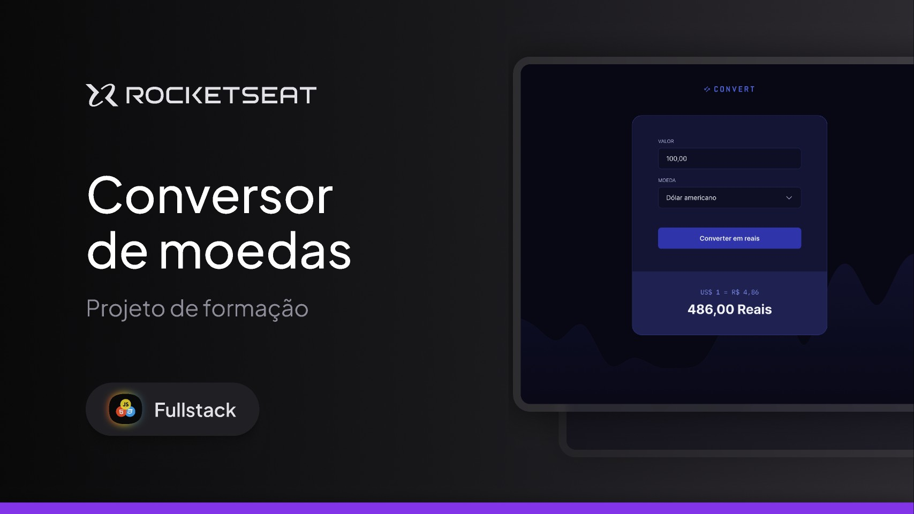

<h1 align="center">Conversor de moedas</h1>

Aplicação web de conversão de moedas Convert. Projeto desenvolvido durante aulas do curso Fullstack da Rocketseat, com foco na aplicação de Javascript e Node.js.

  <a href="#-tecnologias">Tecnologias</a>&nbsp;&nbsp;&nbsp;|&nbsp;&nbsp;&nbsp;
  <a href="#-projeto">Projeto</a>&nbsp;&nbsp;&nbsp;|&nbsp;&nbsp;&nbsp;

  

 

  

## 🚀 Tecnologias

Este projeto foi desenvolvido com as seguintes tecnologias:

- HTML e CSS
- Javascript
- Node.js
- Git e GitHub  
- Figma

## 💻 Projeto

Aplicação para conversão de moedas.

- [Acesse o projeto finalizado online](https://dev-filipebcs.github.io/convert/)
